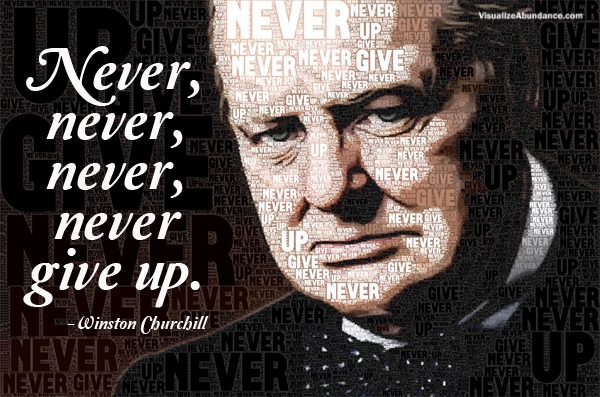

# `while` exercise

```javascript
var starWarsMovies;
starWarsMovies = [ 'anh', 'tesb', 'rotj', 'tpm', 'aotc', 'rots', 'tfa'];

function sortChronologically() {
  var i;
  var tmp;
  for (i = 0; i < 3; i++) {
    tmp = starWarsMovies[i];
    starWarsMovies[i] = starWarsMovies[i + 3];
    starWarsMovies[i + 3] = tmp;    
  }
}

function chewie() {
  var i;
  for (i = 0; i < starWarsMovies.length; i++) {
    if (starWarsMovies[i] === 'tpm' || starWarsMovies[i] === 'aotc') {
      console.log('Which way to Kashyyyk?');
    } else {
      console.log('Laugh it up fuzzball!');
    }
  }
}

chewie();
sortChronologically();
chewie();
```

1. Convert the following `for` loops to `while` loops:

2. Replace Han with per-movie Wookie noises using `if...else if...else`:
http://www.buzzfeed.com/jessicamisener/the-10-best-chewbacca-quotes

---

# Day 6 Agenda

* Review: `while` exercise
* Quick word on formatting
* `Object`

---

# Style


Remember the target audience of your code is *people*.

Formatting and good naming helps our code to be readable.

#### jsbeautify: Install from package manager

Sorry, you're on your own when it comes to names...

> There are only two hard things in Computer Science: cache invalidation and naming things.
>
> -- Phil Karlton, Principal Curmudgeon, Netscape

---

# Never, never, never...




---

# `Object`

Two uses:
1. Record of structured data
2. Index of key-value pairs (aka. Map)

---

# `Object` literal

Defined ahead of time:

```javascript
var myObject =
  { keyOfNumber: 3,
    keyOfBoolean: true,
    'key-of-string': 'str',
    keyOfObject: { key5: 'nested'},
    keyOfArray: [ 0, 1 ] };

console.log(myObject.keyOfNumber);

console.log(myObject['key-of-string']);
```

---

# Properties and Methods

> An object is a collection of properties, and a property is an association between a name (or key) and a value. A property's value can be a function, in which case the property is known as a method.

Example of property:
```
var myArr = [ 1, 2, 3 ];
myArr.length  // <- length is property
```

Example of method:
```
console.log  // <- log is method
```

---

# Method declaration

```
var myObject = {
    myMethod: function (x) {
        // do something with x...
    }
};
```

---

# `Object` as Map

Build as you go:

```javascript
var myMap = {};
var myKey = 'some string';
var myValue = 27;

myMap[myKey] = myValue;

myObject.myMethod = function (x) {
    // do something with x...
}
```

---

# Map iteration example: Environment Variables

process.env is just an `Object`

```
for (var key in process.env) {
    if (key === 'PATH') {

        var isWin = /^win/.test(process.platform);
        var delimeter = isWin ? ';' : ':';
        var pathElems = process.env.PATH.split(delimeter);

        for (var k = 0; k < pathElems.length; k++) {
            console.log(key, k, pathElems[k]);
        }
    } else {
        console.log(key, process.env[key]);
    }
}
```

---

# Exercises

https://gist.github.com/sgnl/688a2c95920d0d3d617c


# Mention Next Time

modifying an object/array in a function is preserved
pass by reference
closures and higher order functions
capturing a return value
emp
